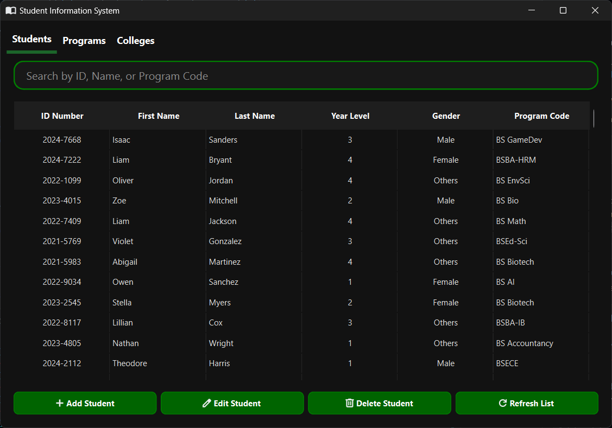
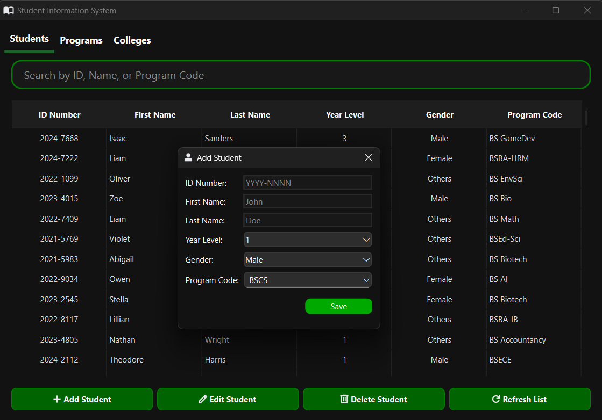
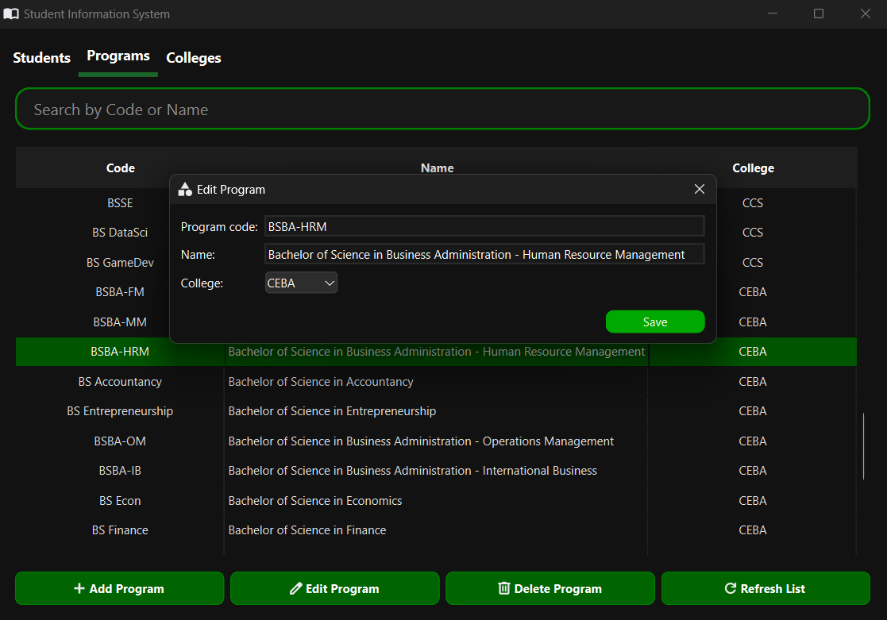

# 🎓 Simple Student Information System

## 🚀 Overview
The **Simple Student Information System** is a lightweight and user-friendly application that enables efficient management of students, programs, and colleges. Built with **PyQt6**, it features an intuitive graphical interface and leverages **CSV files** for seamless data storage.

## ✨ Features
✔ **Student Management** - Add, edit, delete, and list students 📋  
✔ **Program Management** - Add, edit, delete, and list programs 🎓  
✔ **College Management** - Add, edit, delete, and list colleges 🏛️  
✔ **Search Functionality** - Quickly find students, programs, and colleges 🔍  
✔ **Data Validation** - Ensures accuracy and prevents errors ✅  
✔ **Keyboard Shortcut** - Press `Escape` to unselect all rows ⌨️  


## 🔧 Installation
### 📌 Prerequisites
- Python **3.9 or higher** must be installed.
- Required Python libraries: `pandas` and `pyqt6`

### 📥 Steps to Install
1️⃣ **Clone the Repository** or download the source code:
   ```sh
   git clone https://github.com/your-repo/student-info-system.git
   cd student-info-system
   ```
2️⃣ **Install Dependencies**:
   ```sh
   pip install pandas pyqt6
   ```
3️⃣ **Run the Application**:
   ```sh
   python gui.py
   ```

---
## 📂 Project Structure
📝 `gui.py` - The main GUI application file.  
📝 `student_handler.py` - Handles student CRUD operations.  
📝 `program_handler.py` - Manages program-related data.  
📝 `college_handler.py` - Manages college-related data.  
📝 `csv_handler.py` - Utility functions for handling CSV files.  
📁 `csv-files/` - Stores all CSV data files.  
📁 `icons/` - Contains application icons.  

---
## 📑 Data Storage (CSV Files)
The system uses **CSV files** for lightweight and easy-to-manage storage:

📌 `Student.csv` - Stores student details.  
📌 `Program.csv` - Stores available programs.  
📌 `College.csv` - Stores college information.  

---
## 🎯 Usage Guide
1️⃣ **Launch the Application** - Open `gui.py` and start managing student data.  
2️⃣ **Search & Manage Records** - Use the search bar to find students, programs, and colleges instantly.  
3️⃣ **Edit & Delete with Ease** - Modify records or remove outdated entries with a few clicks.  
4️⃣ **Enjoy a Smooth UI** - Navigate effortlessly with an intuitive interface.  

---
## 🎨 Screenshots






---
## 🛠️ Future Enhancements
🚀 **Database Integration** - Upgrade to SQLite/MySQL for better scalability.  
📊 **Data Visualization** - Charts and statistics for insights.  
🔐 **User Authentication** - Secure access with login functionality.  
💻**User Experience (UX) Improvements** - Confirmation Dialogs, Sorting Indicators, and Export functionality.


---
## 📜 License
This project is licensed under the **MIT License**. Feel free to modify and use it as needed!


